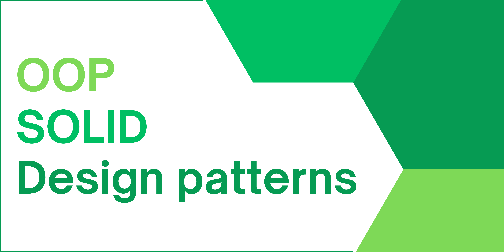
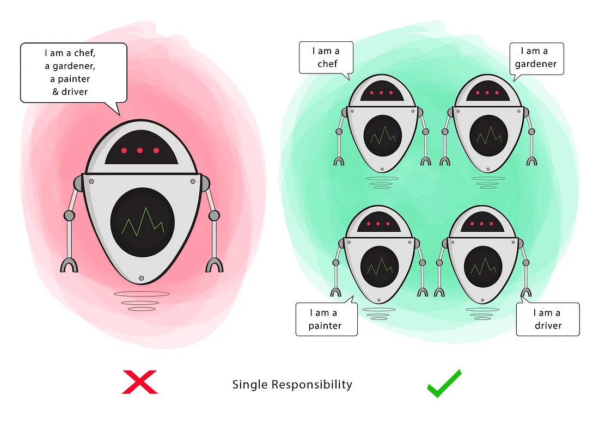
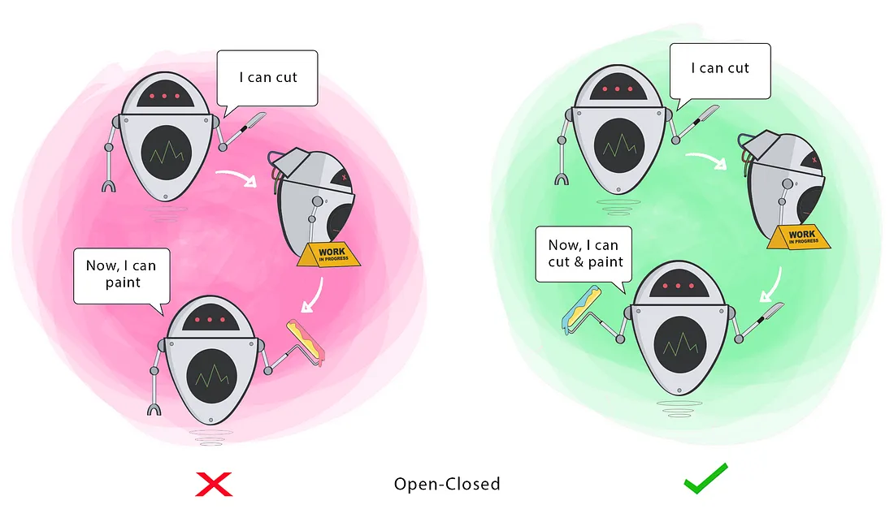
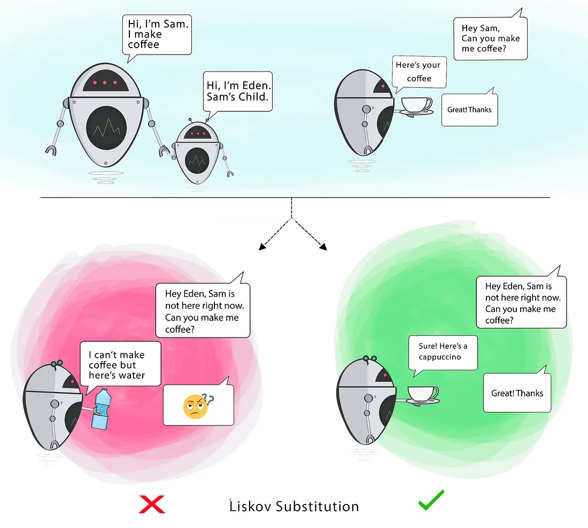
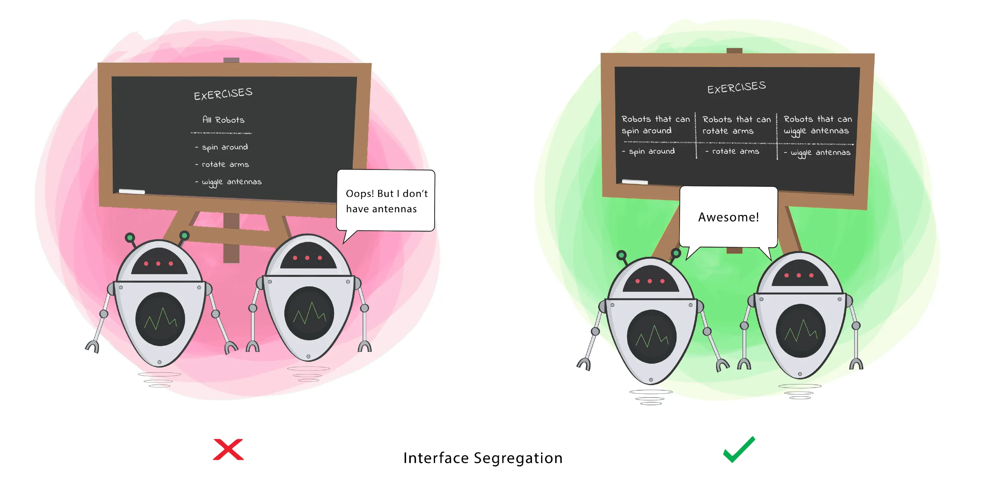
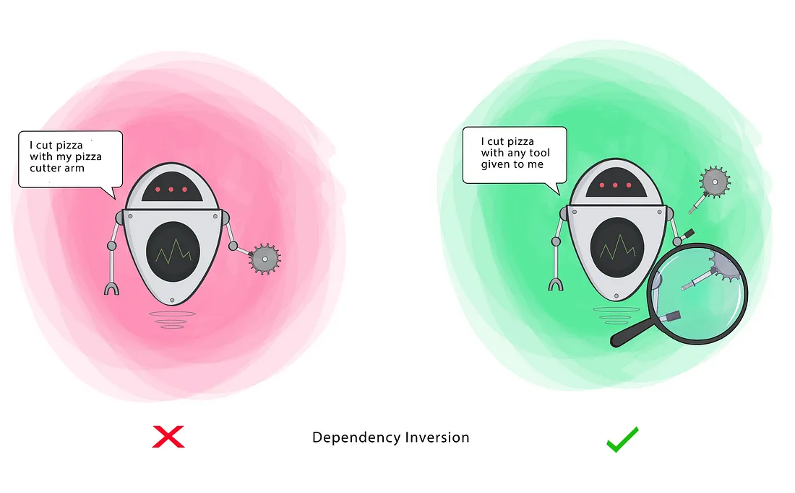

<h1 id="my-title"> OOP + SOLID + Design Patterns </h1>

[](https://badges.pufler.dev) [](https://badges.pufler.dev)   



⚠️ If you find any mistakes, please open an issue.

⚠️ The solid illustrations in this repository are by `Ugonna Thelma.`

## Table of Contents

- [OOP (Object-Oriented Programming)](#oop)
    - [Inheritance](#inheritance)
    - [Encapsulation](#encapsulation)
    - [Polymorphism](#polymorphism)
    - [Abstraction](#abstraction)
- [SOLID](#solid)
    - [Single Responsibility Principle (SRP)](#srp)
    - [Open-Closed Principle (OCP)](#ocp)
    - [Liskov Substitution Principle (LSP)](#lsp)
    - [Interface Segregation Principle (ISP)](#isp)
    - [Dependency Inversion Principle (DIP)](#dip)
- [Design Patterns](#design-patterns)
    - [Creational Design Patterns](#creational-design-patterns)
        -  [Singleton](#singleton)
        -  Factory Method
        -  Abstract Factory
        -  Builder
        -  Prototype
    - Structural Design Patterns
        - Facade
        - Decorator
        - Flyweight
        - Proxy
        - Adapter
        - Bridge
        - Composite
    - Behavioral Design Patterns
        - Template Method
        - Observer
        - Mediator
        - Chain of Responsibility
        - Command
        - State
        - Iterator
        - Memento
        - Visitor
        - Strategy  

    
### <a name="oop">🟩 OOP (Object-Oriented Programming)</a>
Object-Oriented Programming (OOP) is a programming paradigm that organizes code
around objects, each encapsulating data and behaviors. It promotes modularity,
reusability, and easier maintenance of software systems.

#### <a name="inheritance">🟢 Inheritance </a>
Allowing a class (subclass) to inherit attributes and behaviors from another class (superclass), promoting `code reuse` and `reducing duplication`.

In inheritance, `Is a` refers to the relationship between a subclass and a
superclass, indicating that the subclass is a specialized version of the
superclass.

For example, since Ali is a Developer, if we have a class `Developer` and a subclass `Ali`
we can say that `Ali is a Developer.`

Without Inheritance:
```Kotlin
class Developer {
  var name:String
  fun coding() {
    print("Coding")
  }
}

class Ali { 
  var name:String
  fun coding() {
    print("Coding")
  }
}
```
With Inheritance:
```Kotlin
open class Developer {
    var name: String
    fun coding() {
        print("Coding")
    }
}

class Ali : Developer()
```

#### <a name="encapsulation">🟢 Encapsulation </a>

> In object-oriented programming languages, and other related fields, encapsulation refers to one of two related but
> distinct notions, and sometimes to the combination thereof:
> - A language mechanism for restricting direct access to some of the object's components.
> - A language construct that facilitates the bundling of data with the methods (or other functions) operating on those
    data. <a href="https://en.wikipedia.org/wiki/Encapsulation_(computer_programming)">Wikipedia</a>

For example, We bundle the age and eating in a class as a Person, and with
`access modifiers` and `getter/setter`, we protect and control the data from unauthorized access.

```Kotlin
class Person {

    var age: Int
        get() = "My age is $field"
        set(value) {
            if (value in 1..100) {
                field = value
            }
        }

    fun eating() {
        print("Eating food...")
    }

}

```

```Kotlin
fun main() {
    val ali = Person()
    ali.age = -1 ❌
    ali.age = 190 ❌
}
```
#### <a name="polymorphism">🟢 Polymorphism </a>
Polymorphism enables the execution of a single action through multiple
implementations, reflecting `many forms.`

This is an example:
```Kotlin 
interface Shape {
  fun draw()
}

class Circle : Shape {
  override fun draw() {
    println("Drawing a circle")
  }
}

class Rectangle : Shape {
  override fun draw() {
    println("Drawing a rectangle")
  }
}

class Square : Shape {
  override fun draw() {
    println("Drawing a square")
  }
}
```
```Kotlin

fun main() {
  val array: Array<Shape> = arrayOf(Square(), Rectangle(), Circle())
  array.forEach { 
      it.draw()
  }
}
```
```text
1 action (draw)
3 implemention
Drawing a square
Drawing a rectangle
Drawing a circle
```
#### <a name="abstraction">🟢 Abstraction </a>
The process of simplifying complex systems by focusing on essential
characteristics while hiding unnecessary details. In Java or Kotlin,
abstraction can be achieved using abstract classes and interfaces.

This <a href='https://stackoverflow.com/a/46041373/11532220'>answer</a> on
Stack Overflow can lead to a better understanding of the abstraction.

### <a name="solid" >🟩 SOLID</a>
The Solid Principles are a set of coding principles that provide a guide to writing maintainable, scalable, and robust software.
The Solid principles are not limited to classes, it can be applied to various software entities such as modules, functions, and components.

- `S` Single Responsibility Principle (SRP)
- `O` Open-Closed Principle (OCP)
- `L` Liskov Substitution Principle (LSP)
- `I` Interface Segregation Principle (ISP)
- `D` Dependency Inversion Principle (DIP)

#### <a name="srp">🟢 Single Responsibility Principle (Srp)</a>
A class should have only one reason to change, meaning it should have only one responsibility.



Before:

```kotlin
class DatabaseManager(private val databaseName: String) {
    
    fun connectToDatabase(){
        // Implementation code removed for better clarity.
    }

    fun saveDataToDatabase() {
        try {
            // Implementation code removed for better clarity.
            // Perform some operation that may throw an exception.
        } catch (e: Exception) {
            /* 
            ❌ This code violates the Single Responsibility Principle (SRP)
             because the `DatabaseManager` class has two responsibilities:
            1. Saving data to the database.
            2. Writing an error message to a log file.
            */
            File("logFile.txt").writeText(e.message!!)
        }
    }
}
```
After:

```kotlin
class DatabaseManager(private val databaseName: String) {

    fun connectToDatabase(){
        // Implementation code removed for better clarity.
    }

    fun saveDataToDatabase() {
        try {
            // Implementation code removed for better clarity.
            // Perform some operation that may throw an exception.
        } catch (e: Exception) {
            // ✅ Ok
            val logger = FileLogger("logFile.txt")
            logger.log(e.message!!)
        }
    }

}
``` 

In this refactored code, the `DatabaseManager` class only focuses on saving data to the database, while the `FileLogger` class is responsible
for logging errors. Each class now has a single responsibility, and any changes related to error logging won't affect the `DatabaseManager` class.

####  <a name="ocp">🟢Open/Closed Principle (Ocp)</a>
Software entities (classes, modules, functions, etc.) should be open for extension but closed for modification.



Before:

```kotlin
class PayCalculator(var currency: String) {

    // We use currency in implementation.

    fun calculatePay(typeEmployee: TypeEmployee) {
        if (typeEmployee == TypeEmployee.FULL_TIME) {
            // Implementation code removed for better clarity
        } else if (typeEmployee == TypeEmployee.PART_TIME) {
            // Implementation code removed for better clarity
        } else if (typeEmployee == TypeEmployee.CONTRACTOR) {
            // Implementation code removed for better clarity
        } else {
            // Implementation code removed for better clarity
        }
    }

    enum class TypeEmployee { FULL_TIME, PART_TIME, CONTRACTOR }

   // Other methods
}
```
- The class isn't closed for modification because modifications are needed whenever a new employee type is added.
- The class isn't open for extension because you would need to modify the existing class and add new conditions to handle new employee types.

After:

We don't need enum after refactoring, so delete it.
```kotlin
interface Payable{
    fun calculatePay()
}
```

```kotlin
class FullTimeEmployeePayable(var hoursWorked:Double) : Payable {
    override fun calculatePay() {
        // Implementation code removed for better clarity
    }
}
class PartTimeEmployeePayable(var hourlyRate:Double) : Payable {
    override fun calculatePay() {
        // Implementation code removed for better clarity
    }
}
class ContractorPayable(var projectDuration:Double) : Payable {
    override fun calculatePay() {
        // Implementation code removed for better clarity
    }
}
```

```kotlin
class PayCalculator(var currency: String) {

    // We use currency in implementation.

    fun calculatePay(payable: Payable) {
        // Implementation code removed for better clarity
        payable.calculatePay()
    }
   // Other methods
}
```

#### <a name="lsp">🟢 Liskov’s Substitution Principle (Lsp)</a>
Subtypes must be replaceable with their base types without affecting the correctness of the program.



Before:

```kotlin
open class Rectangle(var width: Int, var height: Int) {
    open fun calculateArea(): Int {
        return width * height
    }
}
```
```kotlin
class Square(side: Int) : Rectangle(side, side) {

    override fun calculateArea(): Int {
        if (height != width)
            throw IllegalArgumentException("The width and height of a square should be equal!")
        return width * width
    }
}
```

```kotlin
fun main() {
    val rectangle: Rectangle = getDefaultRectangle()
    rectangle.width = 7
    rectangle.height = 8
    println(rectangle.calculateArea())
}

private fun getDefaultRectangle(): Rectangle {
    return Rectangle(3, 6)
}

private fun getDefaultSquare(): Rectangle {
    return Square(3)
}
```
The program encounters a problem when we replace the rectangle (`getDefaultRectangle`)
with a square (`getDefaultSquare`).

After:

```kotlin
interface Shape {
    fun calculateArea(): Int
}
```
```kotlin
class Rectangle(var width: Int, var height: Int) : Shape {
    override fun calculateArea(): Int {
        return width * height
    }
}
```
```kotlin
class Square(var side: Int) : Shape {
    override fun calculateArea(): Int {
        return side * side
    }
}
```
#### <a name="isp">🟢 Interface Segregation Principle (Isp) </a>
Many client-specific interfaces are better than one general-purpose interface. Clients should not be forced to depend on interfaces they do not use.

Bad example
```kotlin
interface Animal {
    fun fly()
    fun swim()
}
```
Good example
```kotlin
interface Flyable {
    fun fly()
}
interface Swimmable  {
    fun swim()
}
```



Before:

```kotlin
interface Worker {
    fun work()
    fun eat()
}
```
```kotlin
class Robot(private val numberRobot:Int) : Worker {
    override fun work() {
        // Implementation code removed for better clarity.
    }

    override fun eat() {
        // ❌ ISP (Interface Segregation Principle) violation occurs when a class does not need a method.
        // This method is not applicable to a robot.
        throw UnsupportedOperationException("Robots don't eat!")
    }

}


class Human(private val name:String) : Worker {
    override fun work() {
        // Implementation code removed for better clarity.
    }

    override fun eat() {
        // Implementation code removed for better clarity.
    }
}

```

After:

```kotlin
interface Workable {
    fun work()
}

interface Eatable {
    fun eat()
}
```
```kotlin
class Human(private val name:String) : Workable, Eatable {
    override fun work() {
        // Implementation code removed for better clarity.
    }

    override fun eat() {
        // Implementation code removed for better clarity.
    }
}

class Robot(private val numberRobot:Int) : Workable {
    override fun work() {
        // Implementation code removed for better clarity.
    }
}

```

#### <a name="dip">🟢 Dependency Inversion Principle (Dip)</a>
High-level modules should not depend on low-level modules, both should depend on abstractions.



❌ Problem: Suppose we have another logger class, then should we create another class like `DatabaseManager` again?

This class basically only depends on FileLogger, but what if we need DatabaseLogger?

Before:

```kotlin
class DatabaseManager(private val databaseName: String) {

    fun connectToDatabase(){
        // Implementation code removed for better clarity.
    }

    fun saveDataToDatabase() {
        try {
            // Implementation code removed for better clarity.
            // Perform some operation that may throw an exception.
        } catch (e: Exception) {
            val logger = FileLogger("logFile.txt")
            logger.log(e.message!!)
        }
    }

}
```

After:

We create a `Logger` interface and two classes implement it. This `DatabaseManager` class works with any subclass of Logger and depend on abstractions.

 ```kotlin
interface Logger {
    fun log(message: String)
}

class FileLogger(var fileName: String) : Logger {
    override fun log(message: String) {
        File(fileName).writeText(message)
    }
}

class DatabaseLogger(var tableName: String) : Logger {
    override fun log(message: String) {
        // Implementation code removed for better clarity
    }
}
```

```kotlin
class DatabaseManager(
    private val databaseName: String,
    private val logger: Logger
) {

    fun connectToDatabase(){
        // Implementation code removed for better clarity.
        /* In this method, the `logger` is also used because there might
         be an exception occurring during the database connection process.*/
    }

    fun saveDataToDatabase() {
        try {
            // Implementation code removed for better clarity.
            // Perform some operation that may throw an exception.
        } catch (e: Exception) {
            logger.log(e.message!!)
        }
    }

}
```

### <a name="design-patterns">🟩 Design Patterns </a>
Design patterns are solutions to common software design problems.

#### <a name="creational-design-patterns">🟢 Creational Design Patterns </a>

Creational Design Patterns are a set of design patterns that focus on how objects are created and instantiated, providing flexible ways to create objects in different situations.

#### <a name="singleton">🟢 Singelton </a>

Singleton design pattern ensures a class has only one
instance and provides a global point of access to that instance.

```Kotlin
object Singleton {
    // Add properties and methods of the singleton here
}
```

```Kotlin
fun main() {
    val instance1 = Singleton
    val instance2 = Singleton

    // Both instance1 and instance2 refer to the same singleton object
    println(instance1 == instance2) // true
}
```

## License
This repository is licensed under the [MIT License](https://choosealicense.com/licenses/mit/).
